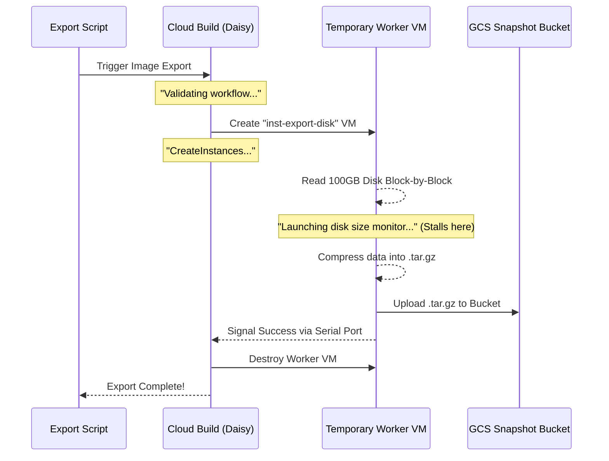

# VM Snapshots

This directory contains utility scripts to help you take point-in-time snapshots of your SQLVagrantLab VM and restore them quickly. 

## Requirements
These scripts rely on `gcloud` being authenticated on your local machine and configured to your active project. 

## Scripts

### 1. `take-snapshot.sh`
Takes an instantaneous Google Compute Persistent Disk snapshot of the VM's current boot disk. Because GCP handles this natively at the storage layer, your VM does not need to be turned off!

**Usage:**
```bash
./take-snapshot.sh <snapshot-name> [project-id]
```

### 2. `restore-snapshot.sh`
Restores the SQLVagrantLab VM state to a previously taken snapshot. It does this automatically in GCP by:
1. Stopping the VM safely.
2. Creating a brand new disk from your saved snapshot.
3. Swapping the VM's old boot disk for the newly created one.
4. Starting the VM.

**Usage:**
```bash
./restore-snapshot.sh <snapshot-name> [project-id]
```

> **Warning:** If you run `terraform apply` after restoring a snapshot, Terraform may notice that the `boot_disk` name has unexpectedly changed and will attempt to recreate the VM or modify it back to its original provisioned state. 

### 3. `export-snapshot-to-bucket.sh`
GCP Snapshots are stored transparently in Google's internal storage (which allows them to be instantaneous). However, if you want to export a snapshot to your dedicated GCS Snapshot Bucket (created by `oneshot/init.sh`) for archival or downloading offline, use this script.

**Important IAM Requirement for Exporting:**
Exporting a snapshot leverages Google Cloud Build under the hood. For this to work, your project's Compute Engine default service account requires the Storage Admin role to write the `.tar.gz` export to your snapshot bucket.

Before running this script for the first time on a project, you MUST run this command:
```bash
# Replace <project-number> with your GCP project's numeric ID (found on the Cloud Console homepage)
gcloud projects add-iam-policy-binding <project-id> \
  --member=serviceAccount:<project-number>-compute@developer.gserviceaccount.com \
  --role=roles/storage.admin
```

**Usage:**
```bash
./export-snapshot-to-bucket.sh <snapshot-name> [project-id]
```

#### How Exporting Works (The "Daisy" Workflow)
Exporting a snapshot is not a simple file copy because GCP snapshots are not stored as traditional files. When you run this script, GCP triggers a background Cloud Build process (codenamed "Daisy") to physically convert the snapshot data into a compressed `.tar.gz` archive. 

This process often takes **10-20+ minutes** depending on the size of the disk, and you will see it stall on `GCEExport: Launching disk size monitor in background...` while the worker VM churns through the data.



### 4. Deploying an Exported Snapshot (`bootstrap/snapshots/terraform`)
If you have completely destroyed your environment but want to spin up a brand new VM from a `.tar.gz` snapshot archive you exported to your GCS Snapshot bucket, you can use the alternative Terraform configuration provided in the `terraform/` subdirectory.

This configuration bypasses the `ubuntu-os-cloud` image entirely, builds a custom Google Compute image from your saved archive, and attaches it instantly. Because it is a restored snapshot, there is no bootstrap wait-time!

**Usage:**
1. Navigate to the snapshot terraform directory:
   ```bash
   cd bootstrap/snapshots/terraform
   ```
2. Initialize it (you can utilize the same backend as the primary deployment if you'd like):
   ```bash
   terraform init -upgrade
   ```
3. Apply the environment, providing it the name of your bucket and the exact name of the exported `.tar.gz` archive:
   ```bash
   terraform apply \
     -var="project_id=<your-gcp-project-id>" \
     -var="snapshot_bucket_name=<your-snapshot-bucket-name>" \
     -var="snapshot_archive_name=lab-base-installed.tar.gz"
   ```
